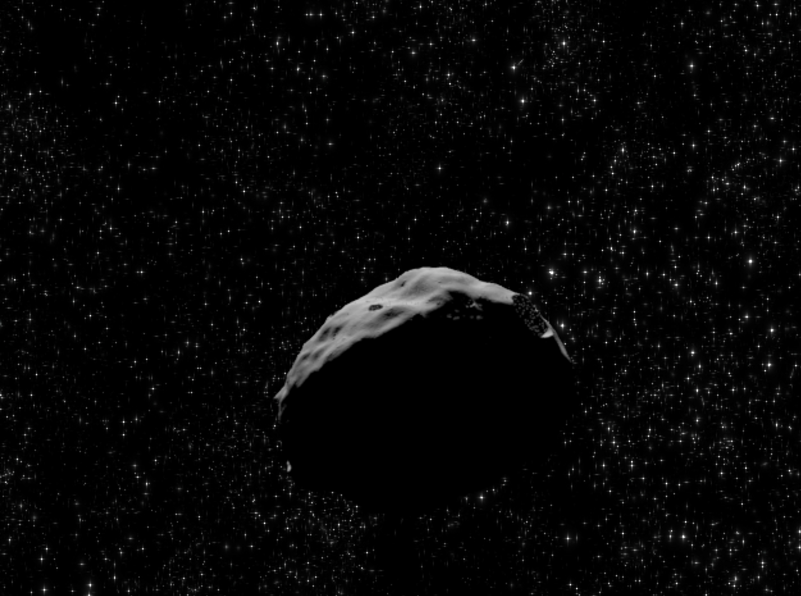

# Asteroid Hunting with synthetic data

In some sitiations, data may be rare or hard to find. For example, NASA’s [discovery statistics database](https://cneos.jpl.nasa.gov/stats/totals.html) as of 10th of March 2023 contained records of 31,519 Near Earth Objects (NEO) collected over the period of 20 years. Still, none of them closely matched characteristics of [asteroid `Oumuamua](https://solarsystem.nasa.gov/asteroids-comets-and-meteors/comets/oumuamua/in-depth), that was detected in 2017.

So, for this project I generated synthetic asteroid images using some open source and proprietary 3D software platforms. The object detection model was trained on Azure Custom Vision platform, before being exported into TensorFlow format. Export process also generated a template class to perform asteroid detections.

- You can see here output of a model tested with the video of an asetroid's fly-by: https://youtu.be/MGzjm-F5YcA.
- This is an example of a generated synthetic asteroid image.

  

